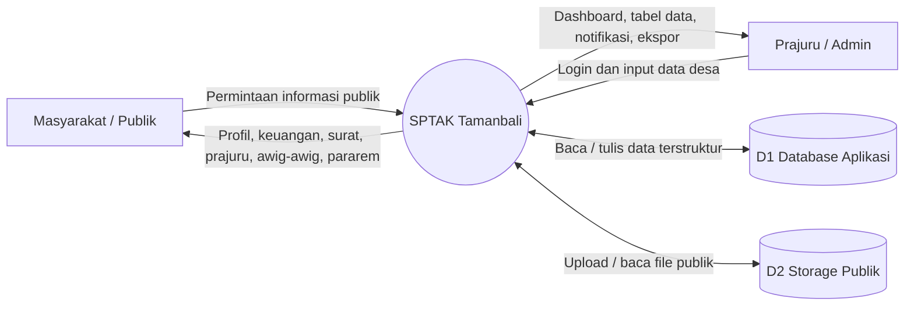
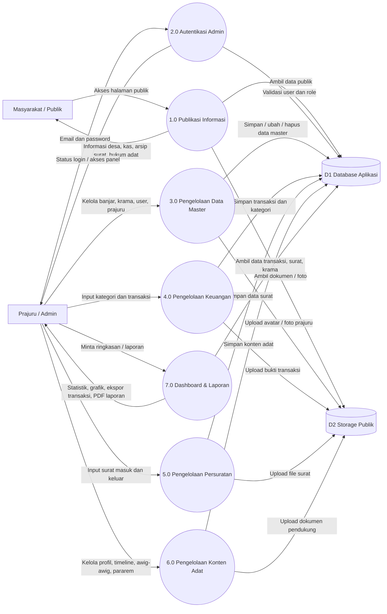
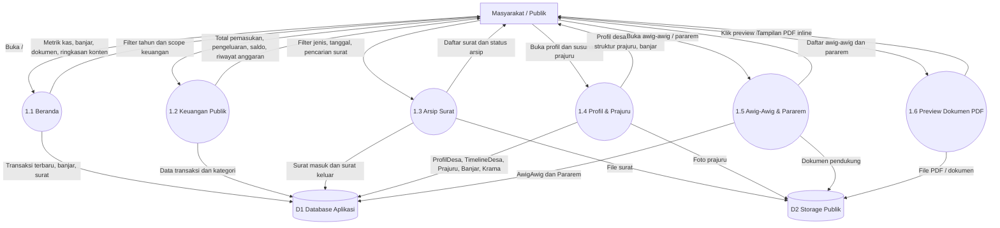
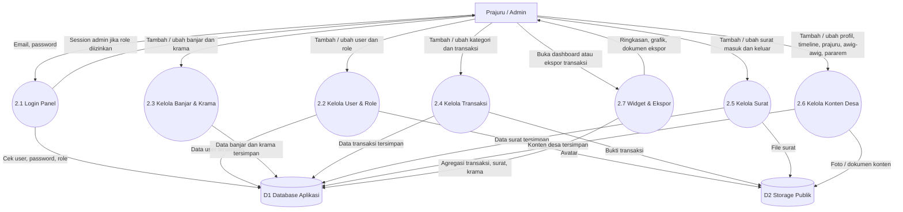

# DFD Sistem SPTAK Tamanbali

Dokumen ini menggambarkan arus data utama sistem SPTAK Tamanbali: portal publik dan panel admin Filament.

## Entitas Eksternal

- **Masyarakat / Publik**: mengakses informasi desa, keuangan, surat, prajuru, awig-awig, dan pararem.
- **Prajuru / Admin**: login ke panel admin dan mengelola data desa.
- **Sistem File Publik**: menyimpan file unggahan seperti avatar, bukti transaksi, foto prajuru, dan dokumen surat.

## Data Store

- **D1 Database Aplikasi**: tabel users, transaksis, kategori_transaksis, banjars, kramas, surat_masuks, surat_keluars, prajurus, profil_desas, timeline_desas, awig_awigs, panarems.
- **D2 Storage Publik**: `storage/app/public` yang diakses lewat `/storage/...`.

## DFD Level 0 — Context Diagram

## DFD Level 1 — Proses Utama

## DFD Level 2 — Portal Publik

## DFD Level 2 — Panel Admin Filament

## Catatan Implementasi Sistem

- Portal publik dikendalikan oleh `routes/web.php` dan `app/Http/Controllers/PublicController.php`.
- Panel admin dikonfigurasi di `app/Providers/Filament/AdminPanelProvider.php`.
- Resource admin berada di `app/Filament/Resources/*`.
- Model domain berada di `app/Models/*`.
- Authorization admin berbasis role di `App\Models\User` dan policy manual di `AppServiceProvider`.
- File upload memakai disk `public`, lalu dibaca dari URL `/storage/...`.
