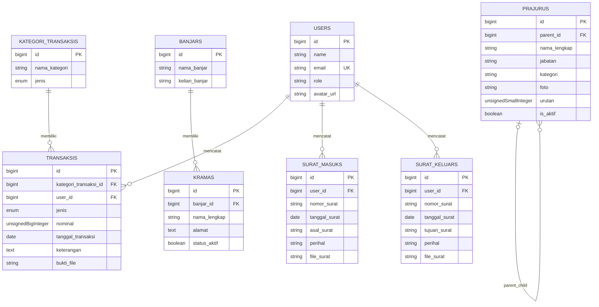
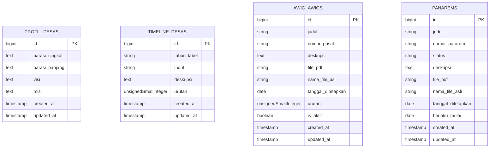
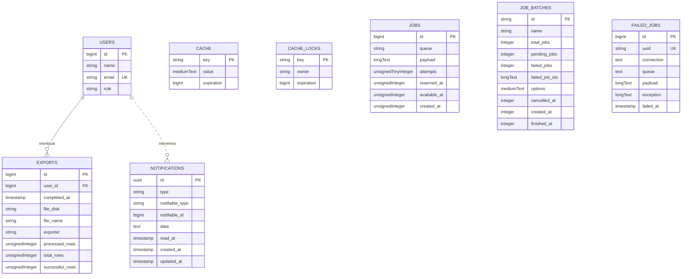

# ERD Sistem SPTAK Tamanbali

Dokumen ini menggambarkan Entity Relationship Diagram (ERD) database SPTAK Tamanbali berdasarkan migration dan relasi Eloquent yang ada di kode.

Sumber utama:

- `database/migrations/*`
- `app/Models/*`
- `app/Filament/Resources/*`

## Ringkasan Relasi Utama

| Relasi | Kardinalitas | Dasar schema |
|---|---:|---|
| `banjars` → `kramas` | 1 : banyak | `kramas.banjar_id` FK ke `banjars.id`, `restrictOnDelete()` |
| `users` → `transaksis` | 1 : banyak | `transaksis.user_id` FK ke `users.id`, `restrictOnDelete()` |
| `kategori_transaksis` → `transaksis` | 1 : banyak | `transaksis.kategori_transaksi_id` FK ke `kategori_transaksis.id`, `restrictOnDelete()` |
| `users` → `surat_masuks` | 1 : banyak | `surat_masuks.user_id` FK ke `users.id` |
| `users` → `surat_keluars` | 1 : banyak | `surat_keluars.user_id` FK ke `users.id` |
| `prajurus` → `prajurus` | 0/1 : banyak | `prajurus.parent_id` FK ke `prajurus.id`, `nullOnDelete()` |
| `users` → `exports` | 1 : banyak | `exports.user_id` FK ke `users.id`, `cascadeOnDelete()` |
| `users` → `notifications` | 1 : banyak konseptual | `notifications.notifiable_type/id` polymorphic; dipakai Filament database notifications |

## ERD Lengkap

```mermaid
erDiagram
    USERS ||--o{ TRANSAKSIS : mencatat
    KATEGORI_TRANSAKSIS ||--o{ TRANSAKSIS : mengelompokkan
    BANJARS ||--o{ KRAMAS : menaungi
    USERS ||--o{ SURAT_MASUKS : mencatat
    USERS ||--o{ SURAT_KELUARS : mencatat
    PRAJURUS o|--o{ PRAJURUS : membawahi
    USERS ||--o{ EXPORTS : membuat
    USERS ||..o{ NOTIFICATIONS : menerima

    USERS {
        bigint id PK
        string name
        string email UK
        timestamp email_verified_at
        string password
        string role
        string remember_token
        string avatar_url
        timestamp created_at
        timestamp updated_at
    }

    BANJARS {
        bigint id PK
        string nama_banjar
        string kelian_banjar
        timestamp created_at
        timestamp updated_at
    }

    KRAMAS {
        bigint id PK
        bigint banjar_id FK
        string nama_lengkap
        text alamat
        boolean status_aktif
        timestamp created_at
        timestamp updated_at
    }

    KATEGORI_TRANSAKSIS {
        bigint id PK
        string nama_kategori
        enum jenis
        timestamp created_at
        timestamp updated_at
    }

    TRANSAKSIS {
        bigint id PK
        bigint kategori_transaksi_id FK
        bigint user_id FK
        enum jenis
        unsignedBigInteger nominal
        date tanggal_transaksi
        text keterangan
        string bukti_file
        timestamp created_at
        timestamp updated_at
    }

    SURAT_MASUKS {
        bigint id PK
        string nomor_surat
        date tanggal_surat
        string asal_surat
        string perihal
        string file_surat
        bigint user_id FK
        timestamp created_at
        timestamp updated_at
    }

    SURAT_KELUARS {
        bigint id PK
        string nomor_surat
        date tanggal_surat
        string tujuan_surat
        string perihal
        string file_surat
        bigint user_id FK
        timestamp created_at
        timestamp updated_at
    }

    PRAJURUS {
        bigint id PK
        bigint parent_id FK
        string nama_lengkap
        string jabatan
        string kategori
        text deskripsi
        string foto
        unsignedSmallInteger urutan
        boolean is_aktif
        timestamp created_at
        timestamp updated_at
    }

    PROFIL_DESAS {
        bigint id PK
        text narasi_singkat
        text narasi_panjang
        text visi
        text misi
        timestamp created_at
        timestamp updated_at
    }

    TIMELINE_DESAS {
        bigint id PK
        string tahun_label
        string judul
        text deskripsi
        unsignedSmallInteger urutan
        timestamp created_at
        timestamp updated_at
    }

    AWIG_AWIGS {
        bigint id PK
        string judul
        string nomor_pasal
        text deskripsi
        string file_pdf
        string nama_file_asli
        date tanggal_ditetapkan
        unsignedSmallInteger urutan
        boolean is_aktif
        timestamp created_at
        timestamp updated_at
    }

    PANAREMS {
        bigint id PK
        string judul
        string nomor_pararem
        string status
        text deskripsi
        string file_pdf
        string nama_file_asli
        date tanggal_ditetapkan
        date berlaku_mulai
        timestamp created_at
        timestamp updated_at
    }

    EXPORTS {
        bigint id PK
        timestamp completed_at
        string file_disk
        string file_name
        string exporter
        unsignedInteger processed_rows
        unsignedInteger total_rows
        unsignedInteger successful_rows
        bigint user_id FK
        timestamp created_at
        timestamp updated_at
    }

    NOTIFICATIONS {
        uuid id PK
        string type
        string notifiable_type
        bigint notifiable_id
        text data
        timestamp read_at
        timestamp created_at
        timestamp updated_at
    }

    CACHE {
        string key PK
        mediumText value
        bigint expiration
    }

    CACHE_LOCKS {
        string key PK
        string owner
        bigint expiration
    }

    JOBS {
        bigint id PK
        string queue
        longText payload
        unsignedTinyInteger attempts
        unsignedInteger reserved_at
        unsignedInteger available_at
        unsignedInteger created_at
    }

    JOB_BATCHES {
        string id PK
        string name
        integer total_jobs
        integer pending_jobs
        integer failed_jobs
        longText failed_job_ids
        mediumText options
        integer cancelled_at
        integer created_at
        integer finished_at
    }

    FAILED_JOBS {
        bigint id PK
        string uuid UK
        text connection
        text queue
        longText payload
        longText exception
        timestamp failed_at
    }
```

## ERD Domain Bisnis

Diagram ini hanya memuat tabel inti yang langsung dipakai portal publik dan panel admin.

## ERD Konten Publik

Tabel berikut berdiri sendiri tanpa foreign key langsung. Data dibaca oleh halaman publik dan dikelola lewat Filament.

## ERD Tabel Sistem

Tabel sistem berasal dari Laravel, Filament Export, queue, cache, dan notification.

## Detail Constraint dan Catatan

- `kramas.banjar_id` memakai `restrictOnDelete()`: banjar tidak boleh dihapus jika masih memiliki krama.
- `transaksis.kategori_transaksi_id` memakai `restrictOnDelete()`: kategori transaksi tidak boleh dihapus jika masih dipakai transaksi.
- `transaksis.user_id` memakai `restrictOnDelete()`: user pencatat tidak boleh dihapus jika masih punya transaksi.
- `prajurus.parent_id` memakai `nullOnDelete()`: jika atasan dihapus, bawahan tetap ada dan `parent_id` menjadi `NULL`.
- `exports.user_id` memakai `cascadeOnDelete()`: export ikut terhapus saat user dihapus.
- `notifications` memakai relasi polymorphic Laravel (`notifiable_type`, `notifiable_id`), bukan foreign key database biasa.
- `panarems` memakai nama tabel migration `panarems`, sedangkan model Eloquent bernama `Pararem` dan mengatur `protected $table = 'panarems'`.
- `kramas.nik` pernah dibuat, lalu dihapus oleh migration `2026_04_20_001741_drop_nik_from_kramas_table.php`; ERD memakai kondisi schema akhir.
- `users.role` awalnya `ENUM`, lalu diubah menjadi `string` oleh migration `2026_04_18_000001_change_role_column_in_users_table.php`.
- Model `DashboardDocument` menunjuk tabel `dashboard_documents`, tetapi tidak ada migration tabel tersebut dalam repo saat dokumen ini dibuat; karena itu tidak dimasukkan ke ERD utama.

## Mapping Model ke Tabel

| Model | Tabel | Relasi Eloquent utama |
|---|---|---|
| `User` | `users` | `hasMany(Transaksi::class)` |
| `Banjar` | `banjars` | `hasMany(Krama::class)` |
| `Krama` | `kramas` | `belongsTo(Banjar::class)` |
| `KategoriTransaksi` | `kategori_transaksis` | `hasMany(Transaksi::class, 'kategori_transaksi_id')` |
| `Transaksi` | `transaksis` | `belongsTo(KategoriTransaksi::class)`, `belongsTo(User::class)` |
| `SuratMasuk` | `surat_masuks` | `belongsTo(User::class)` |
| `SuratKeluar` | `surat_keluars` | `belongsTo(User::class)` |
| `Prajuru` | `prajurus` | `belongsTo(Prajuru::class, 'parent_id')`, `hasMany(Prajuru::class, 'parent_id')` |
| `ProfilDesa` | `profil_desas` | singleton data content, tanpa FK |
| `TimelineDesa` | `timeline_desas` | tanpa FK |
| `AwigAwig` | `awig_awigs` | tanpa FK |
| `Pararem` | `panarems` | tanpa FK |
